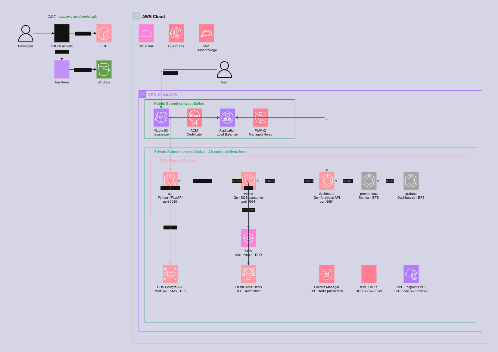

# ecs-combined

A production-grade, end-to-end URL shortener and analytics platform deployed
on AWS ECS Fargate. Three application services, full observability stack,
zero long-lived credentials, zero NAT gateways, and a deployment pipeline
built to production standards.

Also includes a full Kubernetes deployment running locally with minikube.

---

## Overview

The platform shortens URLs, tracks clicks in real time, and exposes analytics
via a read API. Three services run on ECS Fargate behind an ALB with WAF:

| Service | Language | Port | Role |
|---|---|---|---|
| api | Python (FastAPI) | 8080 | Shortens URLs, handles redirects, publishes click events to SQS, serves frontend UI |
| worker | Go | 9091 | Consumes SQS, persists click analytics to PostgreSQL |
| dashboard | Go | 8081 | Read API — top URLs, hourly breakdowns, recent events, summary stats |

---

## Architecture



---

## How It Works

### URL Shortening

POST /shorten { url: "https://google.com" }
→ API generates short code via SHA-256 hash
→ saves to RDS PostgreSQL
→ returns https://hasanali.uk/r/d52c030e

### Redirect Flow
GET /r/d52c030e
→ API checks Redis cache (1ms)
→ cache hit → 302 redirect immediately
→ cache miss → query RDS → cache result → 302 redirect
→ publishes click event to SQS
→ Worker consumes SQS → saves to PostgreSQL

### Analytics
GET /summary → total URLs, total clicks, clicks last hour
GET /top-urls → top URLs by click count
GET /hourly → clicks grouped by hour
GET /recent → last 50 click events

---

## How to Run Locally

Requirements: Docker Desktop

```bash
git clone https://github.com/haz365/ecs-combined
cd ecs-combined
docker compose up --build
```

Services:
- API + UI: http://localhost:8080
- Dashboard API: http://localhost:8081
- Grafana: http://localhost:3000 (admin / devgrafana)
- Prometheus: http://localhost:9090

Test the flow:

```bash
# Shorten a URL
curl -X POST http://localhost:8080/shorten \
  -H "Content-Type: application/json" \
  -d '{"url": "https://google.com"}'

# Follow the redirect
curl -L http://localhost:8080/r/<short_code>

# Check analytics
curl http://localhost:8081/summary
curl http://localhost:8081/top-urls
```

---

## How to Run on Kubernetes (local)

Requirements: minikube, kubectl

```bash
# Start cluster
minikube start

# Point Docker to minikube
eval $(minikube docker-env)

# Build images
docker build -f docker/api.Dockerfile -t api:local .
docker build -f docker/worker.Dockerfile -t worker:local .
docker build -f docker/dashboard.Dockerfile -t dashboard:local .

# Deploy everything
kubectl apply -f k8s/base/postgres/
kubectl apply -f k8s/base/redis/
kubectl apply -f k8s/base/localstack/
kubectl apply -f k8s/base/api/
kubectl apply -f k8s/base/worker/
kubectl apply -f k8s/base/dashboard/

# Check everything is running
kubectl get pods

# Access the API
kubectl port-forward service/api-service 8080:80
kubectl port-forward service/dashboard-service 8081:80
```

---

## How to Deploy to AWS

### Prerequisites
- AWS CLI configured
- Terraform >= 1.7
- Docker Desktop

### First time deploy
```bash
# Bootstrap remote state (run once)
cd infra/bootstrap
terraform init
terraform apply -var="project=ecs-combined" -var="aws_region=eu-west-2"

# Full deploy
make deploy-dev
```

### Day to day
```bash
# Deploy everything (terraform + images + services + DNS)
make deploy-dev

# Just push new images and deploy
./scripts/push-images.sh
SHA=$(git rev-parse --short HEAD) ./scripts/deploy-services.sh dev

# Tear down to save money
make destroy-dev
```

### Environments
| Environment | VPC CIDR | RDS | Notes |
|---|---|---|---|
| dev | 10.0.0.0/16 | db.t3.micro | Auto-deploys on merge to main |
| staging | 10.1.0.0/16 | db.t3.small · Multi-AZ | Load tests run here |
| prod | 10.2.0.0/16 | db.t3.medium · Multi-AZ | Manual approval required |

---

## Deployment Workflow

A developer merges a PR to `main` at 3pm on a Tuesday.

### What triggers

**If `app/` or `docker/` changed:**
1. `app-build.yml` triggers
   - Builds all three images for `linux/amd64`
   - Scans with Trivy — fails on HIGH/CRITICAL
   - Generates SBOMs
   - Pushes to ECR tagged with 7-char git SHA
2. `app-deploy.yml` triggers automatically
   - Downloads current ECS task definitions
   - Updates image URIs to new SHA
   - Registers new task definition revisions
   - Calls `ecs update-service` — rolling deploy
   - Checks service stability after 30 seconds

**If `infra/` changed:**
1. `infra-apply.yml` triggers
   - Runs `terraform apply` on dev automatically
   - Staging and prod require manual approval via GitHub Environments

**On any Pull Request touching `infra/`:**
1. `infra-plan.yml` triggers
   - Runs `terraform plan`
   - Posts plan output as PR comment for review

### Database migrations
Migrations run before service deploys using Flyway:
```bash
./scripts/run-migration.sh dev
```
All migrations are backward compatible. Non-additive changes split across multiple deploys.

### Bad deploy detection
- ECS circuit breaker monitors task health during rollout
- If new tasks fail health checks → automatic rollback to previous revision
- Grafana error rate alert fires within 5 minutes if errors exceed 1%

### What the on-call engineer sees
- GitHub Actions: deploy workflow shows status
- Grafana: error rate spike then recovery
- CloudWatch Logs: `/ecs/ecs-combined-prod/api` shows crash reason
- ECS console: deployment status and events

### Non-rollbackable migrations
1. Keep old column alongside new one
2. Deploy service that reads both
3. Backfill data
4. Deploy removing old column reads
5. Drop old column in final migration

---

## Observability

### Dashboards (Grafana)
| Dashboard | What to look at first during an incident |
|---|---|
| Service Health | Error rate, p95 latency per service |
| Infrastructure | ECS CPU/memory, goroutines, SQS depth |
| Business Metrics | URLs shortened/hour, click events, redirects |
| Deployment Tracking | Process start times, error rate before/after deploy |

### Alerts (CloudWatch → SNS → Email)
| Alert | Threshold | Action |
|---|---|---|
| API p95 latency | > 500ms for 5min | Check RDS CPU, connections |
| Error rate | > 1% for 5min | Check logs, recent deploy |
| SQS depth | > 1000 for 10min | Check worker, scale up |
| RDS CPU | > 80% for 5min | Check slow queries |
| Task count below desired | 5min | Check ECS events |

### Structured logging
All services log JSON to CloudWatch with a `trace_id` propagated across
API → SQS → worker via the `X-Trace-ID` header.

---

## Security Posture

| Control | Implementation |
|---|---|
| Zero long-lived credentials | GitHub Actions OIDC — no AWS keys stored anywhere |
| Secrets | Secrets Manager, injected at task start, never in images or env vars |
| Encryption at rest | KMS CMKs for RDS, S3, Secrets Manager, CloudWatch, SQS |
| Network | Private subnets, no NAT, 12 VPC endpoints for AWS service traffic |
| WAF | Core rules, Known Bad Inputs, SQLi, rate limiting 1000 req/min |
| Container hardening | Non-root user, read-only root filesystem, drop ALL capabilities |
| Image security | Trivy scan on every build, SBOM generated, immutable ECR tags |
| IAM | Least-privilege per-service task roles, separate execution and task roles |
| Audit | CloudTrail enabled, VPC Flow Logs to CloudWatch |
| Threat detection | GuardDuty with S3 and malware protection |
| Access | No bastion — SSM Session Manager only for break-glass |

---

## Cost

Estimated monthly cost at rest (eu-west-2):

| Environment | Estimated Cost | Main drivers |
|---|---|---|
| Dev | ~$130/month | VPC endpoints, RDS, ElastiCache |
| Staging | ~$160/month | Multi-AZ RDS, larger instances |
| Prod | ~$220/month | Larger instances, more replicas |

Run `make destroy-dev` when not in use.
AWS Budgets configured with alerts at 50%, 80%, 100% of monthly spend.

---

## Chaos + Load Test Results

### Chaos Test

**Test 1 — Single task kill**

Manually stopped one of two running API tasks while continuously polling `/health`.

Result: Zero downtime. ECS replaced the task within 42 seconds. HTTP 200
on every request throughout recovery.

**Test 2 — All tasks killed (AZ loss simulation)**

Stopped all running API tasks simultaneously.

Result: ~10 seconds of 503 responses. Tasks running again within 48 seconds.

**Finding:** `desired_count >= 2` is required for zero-downtime task replacement.

### Load Test (k6 — local stack)

Total requests:     12,459
Failed requests:    0 (0%)
p50 latency:        8ms
p95 latency:        14ms
p99 latency:        28ms
Shorten p95:        13ms
Redirect p95:       16ms
Peak VUs:           100
Duration:           4m01s

Alarm thresholds set at p95 > 500ms — observed peak was 14ms giving 35x headroom.

---

## Kubernetes (local)

The full stack also runs on Kubernetes using minikube. Manifests are in `k8s/`:

k8s/
├── base/
│   ├── api/           deployment, service, configmap, secret
│   ├── worker/        deployment, service, configmap, secret
│   ├── dashboard/     deployment, service, configmap, secret
│   ├── postgres/      deployment, service, pvc, configmap, secret
│   ├── redis/         deployment, service
│   ├── localstack/    deployment, service, job
│   └── ingress.yaml
└── overlays/
├── dev/
├── staging/
└── prod/

ECS vs Kubernetes comparison:

| Concept | ECS | Kubernetes |
|---|---|---|
| Container spec | Task Definition | Pod spec |
| Service manager | ECS Service | Deployment |
| Load balancing | Target Group | Service |
| Routing | ALB Listener Rule | Ingress |
| Config | Environment vars | ConfigMap |
| Secrets | Secrets Manager | Secret |
| Storage | EFS | PersistentVolumeClaim |
| Auto-scaling | Application Auto Scaling | HorizontalPodAutoscaler |

---

## Trade-offs and What I'd Do With Another Week

**What I'd improve:**
- Add PgBouncer as a connection pooler in front of RDS
- Implement OpenTelemetry tracing end to end
- Add canary deployments using weighted ALB target groups
- Deploy to EKS and compare ECS vs K8s in production
- Add Helm charts for the Kubernetes manifests
- Set up Dependabot for automatic dependency updates
- Add AWS Config rules for compliance drift detection

**Deliberate trade-offs:**
- Self-hosted Prometheus/Grafana over managed — more to operate but teaches more
- Rolling deploy over blue/green — simpler, good enough at this scale
- Single AWS account over multi-account — reduced complexity for solo project
- Standard SQS over FIFO — click events are idempotent, ordering not required
- Kubernetes locally only — EKS would duplicate ECS at extra cost

---

---

## ADRs
- [ADR-001: Database Choice](docs/adr/001-database-choice.md)
- [ADR-002: Monitoring Stack](docs/adr/002-monitoring-stack.md)
- [ADR-003: Deployment Strategy](docs/adr/003-deployment-strategy.md)
- [ADR-004: Secrets Management](docs/adr/004-secrets-management.md)
- [ADR-005: No NAT Gateway](docs/adr/005-no-nat-gateway.md)

## Runbooks
- [001: API returning 5xx](docs/runbooks/001-api-5xx.md)
- [002: SQS queue depth climbing](docs/runbooks/002-sqs-queue-depth.md)
- [003: RDS CPU pegged](docs/runbooks/003-rds-cpu.md)
- [004: Grafana showing no data](docs/runbooks/004-grafana-no-data.md)
- [005: Deploy rolled back automatically](docs/runbooks/005-deploy-rollback.md)