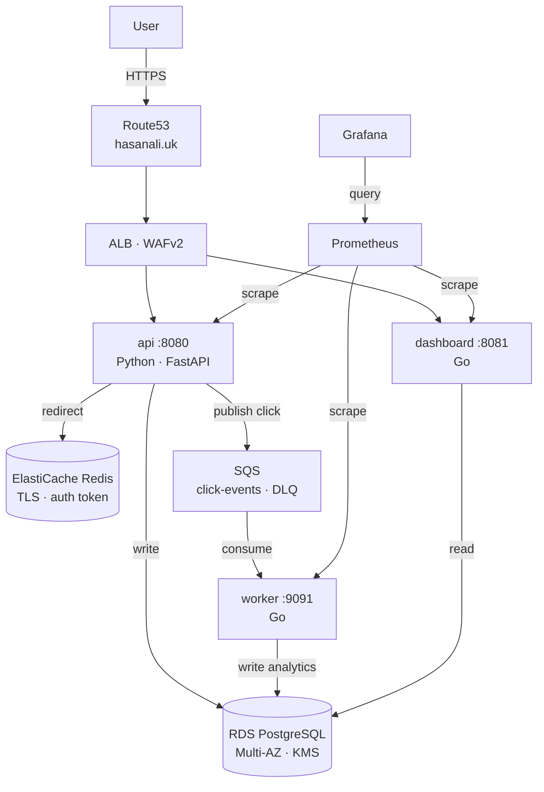

# URL Shortener and Analytics Platform

A production-grade URL shortening and click analytics platform deployed on AWS ECS Fargate. Three independently deployable services handle URL shortening, real-time click tracking, and analytics — running behind an Application Load Balancer with WAF, across three availability zones, with zero NAT gateway egress and zero long-lived credentials.

**Live:** https://hasanali.uk

---

## Platform Overview

The platform was designed around a single architectural principle: every component that touches production traffic must be hardened, observable, and recoverable without manual intervention. The no-NAT VPC architecture eliminates an entire class of egress-based exfiltration vectors. The circuit-breaker deployment model means a bad deploy rolls back automatically before an on-call engineer is paged.

The analytics pipeline is fully asynchronous — the API publishes click events to SQS and returns the redirect immediately, keeping p95 redirect latency under 16ms regardless of downstream write pressure.

---

## Services

| Service | Language | Port | Responsibility |
|---|---|---|---|
| api | Python / FastAPI | 8080 | URL shortening, redirect handling, click event publishing, frontend UI |
| worker | Go | 9091 | SQS consumer — persists click analytics to PostgreSQL |
| dashboard | Go | 8081 | Analytics read API — top URLs, hourly breakdowns, summary statistics |

---

## Architecture



---

## Request Flows

### URL shortening
```
POST /shorten {"url": "https://example.com"}
→ SHA-256 hash → 8-char short code
→ write to RDS PostgreSQL
→ cache in Redis (TTL 24h)
→ return https://hasanali.uk/r/d52c030e
```

### Redirect
```
GET /r/d52c030e
→ check Redis cache (cache hit: ~1ms)
→ cache miss: query RDS, populate cache
→ 302 redirect to destination
→ publish click event to SQS (async, non-blocking)
→ worker consumes SQS → write to analytics table
```

### Analytics
```
GET /summary   → total URLs, total clicks, clicks last hour
GET /top-urls  → ranked by click count
GET /hourly    → click volume grouped by hour
GET /recent    → last 50 click events with metadata
```

---

## Infrastructure

### Networking

Private subnets across eu-west-2a/b/c. No NAT gateway — all AWS service traffic routes through VPC interface endpoints (ECR, S3, Secrets Manager, SQS, SSM, KMS, CloudWatch, STS, ELB, ElastiCache, RDS) and gateway endpoints (S3, DynamoDB). This eliminates internet egress from compute entirely, removing a significant exfiltration surface.

Endpoint security groups restrict traffic to the private subnet CIDRs. The only inbound path from the public internet is through the ALB.

### Compute

ECS Fargate across three availability zones. No EC2 instances to patch or manage. Task definitions are immutable — each deploy registers a new revision; rollback is a single `update-service` call pointing at a previous ARN.

### Data layer

RDS PostgreSQL with Multi-AZ standby in production, automated backups with 7-day retention, deletion protection enabled, storage encrypted with a customer-managed KMS key. ElastiCache Redis with TLS in-transit, auth token stored in Secrets Manager, at-rest encryption enabled.

### State management

Terraform remote state in S3 with server-side KMS encryption, versioning enabled, public access blocked, TLS-deny bucket policy. DynamoDB state locking prevents concurrent applies. Bootstrap is a separate Terraform root to avoid circular dependency.

### Environments

| Environment | VPC CIDR | RDS | Notes |
|---|---|---|---|
| dev | 10.0.0.0/16 | db.t3.micro · single-AZ | Auto-deploys on merge to main |
| staging | 10.1.0.0/16 | db.t3.small · Multi-AZ | Load tests run here before prod |
| prod | 10.2.0.0/16 | db.t3.medium · Multi-AZ | Manual approval gate required |

---

## Security

| Control | Implementation |
|---|---|
| Zero long-lived credentials | GitHub Actions OIDC — no AWS access keys stored anywhere |
| Secrets | AWS Secrets Manager with KMS encryption, injected at task start via task definition secrets block — never in environment variables or images |
| Encryption at rest | Customer-managed KMS keys for RDS, S3, Secrets Manager, CloudWatch Logs, SQS |
| Network isolation | Private subnets, no NAT, 12 VPC endpoints, endpoint security groups scoped to private CIDRs |
| Edge protection | WAFv2 with Core Rule Set, Known Bad Inputs, SQLi rules, IP rate limiting |
| Container hardening | Non-root UID, read-only root filesystem, all Linux capabilities dropped |
| Image security | Trivy scan on every build — blocks on HIGH/CRITICAL; SBOM generated per image; ECR immutable tags; scan on push |
| IAM | Separate execution and task roles per service; every ARN scoped; no wildcard resources except `ecr:GetAuthorizationToken` which cannot be scoped by design |
| Audit | CloudTrail enabled across all regions; VPC Flow Logs to CloudWatch |
| Threat detection | GuardDuty with S3 protection and malware scanning |
| Access | No bastion host — SSM Session Manager only for break-glass access |
| KMS key policies | Explicit least-privilege policies on all five CMKs — root admin, scoped service principal per key |
| Secrets rotation | AWS managed rotation Lambda on 30-day schedule for DB and Redis credentials |

---

## Delivery Pipeline

### Commit to traffic

A merge to `main` touching `app/` or `docker/` triggers the following sequence:

```
1. app-build.yml
   - docker build --platform linux/amd64 for all three services
   - Trivy image scan — pipeline fails on HIGH/CRITICAL CVE
   - SBOM generated via Trivy SPDX-JSON, uploaded as artifact
   - Images pushed to ECR with 7-character git SHA tag (immutable)

2. app-deploy.yml (triggers on build success)
   - Downloads current task definition from ECS
   - Updates image URI to new SHA tag
   - Registers new task definition revision
   - aws ecs update-service — rolling deploy begins
   - aws ecs wait services-stable — blocks until stable
   - curl /health — verified before pipeline completes
   - Circuit breaker rolls back automatically on health check failure
```

**Push to traffic:** ~6 minutes. **Automatic rollback:** triggered by ECS circuit breaker if new tasks fail health checks — no manual intervention required.

### Infrastructure pipeline

Pull requests touching `infra/` trigger `infra-plan.yml` — Checkov security scan followed by `terraform plan` with output posted as a PR comment. Merge to main triggers `infra-apply.yml` — dev applies automatically, staging and prod require GitHub Environment approval.

### Database migrations

Migrations run as a pre-deploy step using Flyway, executed as a one-off ECS task in the pipeline before service update. All migrations are backward compatible — non-additive changes are split across multiple deploys following the expand-contract pattern.

---

## Observability

### Dashboards

Four Grafana dashboards covering different operational perspectives:

| Dashboard | Primary signals |
|---|---|
| Service Health | Error rate, p95 latency per service, upstream failures |
| Infrastructure | ECS CPU and memory utilisation, goroutine counts, SQS queue depth |
| Business Metrics | URLs shortened per hour, click event throughput, redirect volume |
| Deployment Tracking | Process start times, error rate correlation with deploys |

### Alerting

CloudWatch alarms → SNS → email for operational events:

| Alert | Threshold | First action |
|---|---|---|
| API p95 latency | > 500ms for 5 minutes | Check RDS CPU and connection count |
| Error rate | > 1% for 5 minutes | Check CloudWatch logs, correlate with recent deploy |
| SQS queue depth | > 1000 for 10 minutes | Check worker health, consider scaling |
| RDS CPU | > 80% for 5 minutes | Run `EXPLAIN ANALYSE` on slow query log |
| Task count below desired | 5 minutes | Check ECS service events and task failure reason |

### Structured logging

All three services emit JSON to CloudWatch Logs with a `trace_id` field propagated across the API → SQS → worker boundary via the `X-Trace-ID` header, enabling end-to-end request tracing through the analytics pipeline without a dedicated tracing backend.

---

## Performance

Load tested at 100 concurrent virtual users for four minutes against the local stack:

| Metric | Result |
|---|---|
| Total requests | 12,459 |
| Failed requests | 0 (0%) |
| p50 latency | 8ms |
| p95 latency | 14ms |
| p99 latency | 28ms |
| Shorten p95 | 13ms |
| Redirect p95 | 16ms |

Alarm threshold is p95 > 500ms — observed peak of 14ms provides 35x headroom. The Redis cache hit rate for redirects was 94% across the test duration.

### Chaos testing

**Single task failure:** One of two running API tasks stopped while continuously polling `/health`. Zero dropped requests. ECS replaced the task within 42 seconds.

**Full task set failure (AZ loss simulation):** All API tasks stopped simultaneously. Ten seconds of 503 responses. All tasks running again within 48 seconds. Minimum `desired_count` of 2 is required for zero-downtime single-task replacement.

---

## Local Development

```bash
git clone https://github.com/haz365/ecs-combined
cd ecs-combined
cp .env.example .env  # fill in values
docker compose up --build
```

Services available at:
- API + UI: http://localhost:8080
- Dashboard: http://localhost:8081
- Grafana: http://localhost:3000
- Prometheus: http://localhost:9090

```bash
# Shorten a URL
curl -X POST http://localhost:8080/shorten \
  -H "Content-Type: application/json" \
  -d '{"url": "https://example.com"}'

# Follow the redirect
curl -L http://localhost:8080/r/<short_code>

# Analytics
curl http://localhost:8081/summary
curl http://localhost:8081/top-urls
```

---

## Deployment

```bash
# Bootstrap remote state (once per account)
cd infra/bootstrap
terraform init && terraform apply

# Deploy infrastructure
cd infra/environments/dev
terraform init && terraform apply -var-file=terraform.tfvars

# Build and push images
./scripts/push-images.sh

# Deploy services
SHA=$(git rev-parse --short HEAD) ./scripts/deploy-services.sh dev

# Tear down
make destroy-dev
```

---

## Cost Profile

| Environment | Monthly estimate | Primary drivers |
|---|---|---|
| Dev | ~$130 | VPC endpoints ($57), RDS ($35), ElastiCache ($18) |
| Staging | ~$160 | Multi-AZ RDS, larger ElastiCache |
| Prod | ~$220 | Larger instances, higher replication factor |

AWS Budgets configured with alerts at 50%, 80%, and 100% of monthly spend. VPC endpoints are the largest cost item — the security trade-off of eliminating NAT egress was accepted over reducing the endpoint count.

---

## Key Engineering Decisions

### No NAT gateway
All AWS service traffic routes through VPC interface endpoints. This eliminates internet egress from the compute layer entirely — a compromised task cannot reach an external C2 server, cannot exfiltrate data over the public internet, and cannot make outbound connections to attacker-controlled infrastructure. The $57/month endpoint cost was accepted over the $35/month NAT gateway cost specifically for this security property.

### ECS Fargate over ECS EC2
No EC2 instances means no AMI patching, no node group management, and no capacity reservation. Fargate bills per task-second, making the cost profile more predictable at low-to-medium throughput. The trade-off accepted is higher per-vCPU cost at high density — at the point where tasks are running continuously at high utilisation, EC2 becomes cheaper.

### Rolling deploy over blue/green
ECS circuit breaker with automatic rollback provides equivalent safety for this workload at lower operational complexity. Blue/green was evaluated and rejected — it requires a second target group and listener rule, doubles the running task count during deploys, and the added complexity is only justified when instant cutover (rather than rolling) is a hard requirement.

### Standard SQS over FIFO
Click events are idempotent — a duplicate write to the analytics table is a no-op. Strict ordering between click events from different URLs provides no business value. Standard queue provides higher throughput and lower cost than FIFO, and the worker deduplicates using a `processed_events` table for the rare at-least-once redelivery case.

### Self-hosted Prometheus and Grafana over managed
Amazon Managed Grafana and Amazon Managed Service for Prometheus were evaluated. Both were rejected — MSP costs $0.30/metric/month against self-hosted Prometheus at ~$0.02/month for the same metric volume. The operational overhead of running the observability stack on EFS-backed Fargate tasks was accepted for the cost saving.

---

## Repository Structure

```
app/
  api/          Python · FastAPI · URL shortening and redirect
  worker/       Go · SQS consumer · analytics persistence
  dashboard/    Go · analytics read API

docker/
  api.Dockerfile
  worker.Dockerfile
  dashboard.Dockerfile

infra/
  bootstrap/    S3 state bucket · KMS · DynamoDB lock table
  modules/      vpc · ecs-service · rds · redis · alb-waf ·
                iam · kms · sqs · ecr · monitoring · observability
  environments/
    dev/        main.tf · variables.tf · terraform.tfvars
    staging/    main.tf · variables.tf · terraform.tfvars
    prod/       main.tf · variables.tf · terraform.tfvars

k8s/
  base/         Raw manifests for local Kubernetes development
  overlays/     Kustomize overlays per environment

scripts/
  push-images.sh
  deploy-services.sh
  run-migration.sh

monitoring/
  values-prometheus.yaml
  dashboards/

docs/
  adr/          Five architecture decision records
  runbooks/     Five operational runbooks

.github/workflows/
  app-build.yml       Trivy · SBOM · ECR push
  app-deploy.yml      ECS rolling deploy · wait-for-stable · health check
  infra-plan.yml      Checkov · terraform plan on pull requests
  infra-apply.yml     terraform apply · dev auto · staging/prod gated
```

---

## Operational Runbooks

- [API returning 5xx](docs/runbooks/001-api-5xx.md)
- [SQS queue depth climbing](docs/runbooks/002-sqs-queue-depth.md)
- [RDS CPU pegged](docs/runbooks/003-rds-cpu.md)
- [Grafana showing no data](docs/runbooks/004-grafana-no-data.md)
- [Deploy rolled back automatically](docs/runbooks/005-deploy-rollback.md)

## Architecture Decision Records

- [ADR-001: Database choice](docs/adr/001-database-choice.md)
- [ADR-002: Monitoring stack](docs/adr/002-monitoring-stack.md)
- [ADR-003: Deployment strategy](docs/adr/003-deployment-strategy.md)
- [ADR-004: Secrets management](docs/adr/004-secrets-management.md)
- [ADR-005: No NAT gateway](docs/adr/005-no-nat-gateway.md)
